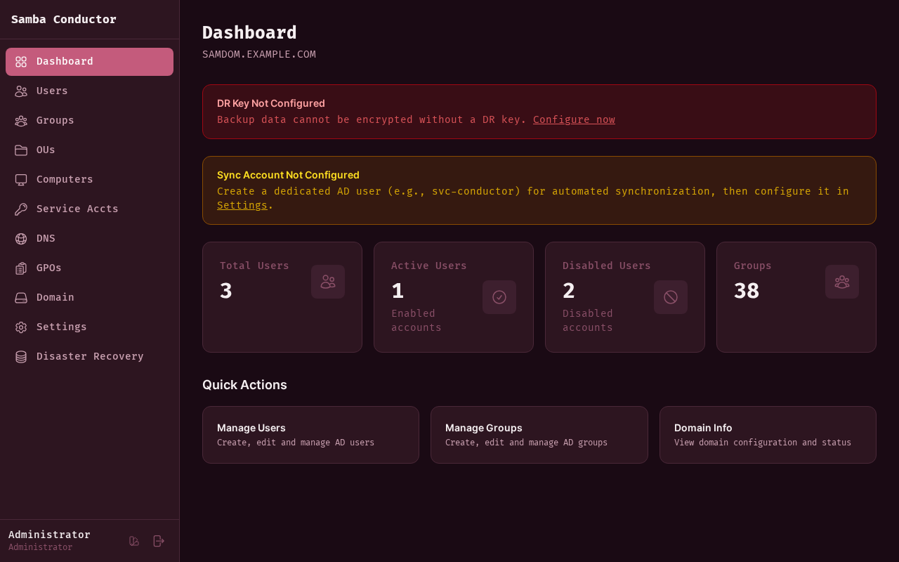
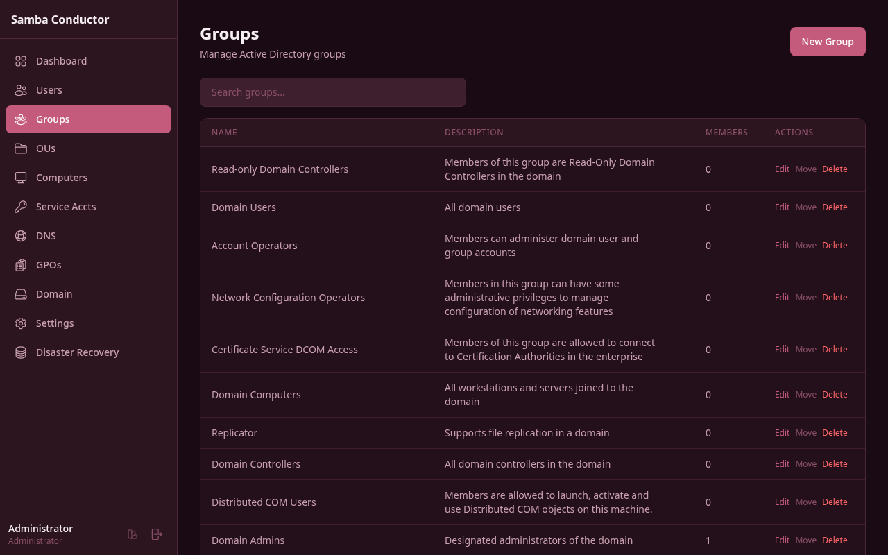
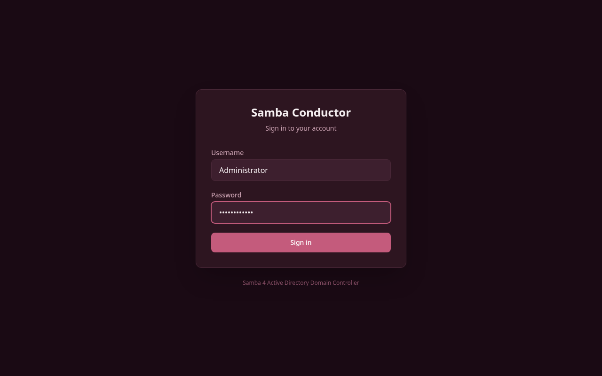

<p align="center">
  
</p>

<p align="center">
  <strong>Modern Web UI for Samba 4 Active Directory Domain Controller</strong>
</p>

<p align="center">
  
  <a href="LICENSE"></a>
  
  
  
  
  
</p>

<p align="center">
  <a href="docs/README.md">Documentation</a> &bull;
  <a href="docs/admin/getting-started.md">Getting Started</a> &bull;
  <a href="docs/infra/docker-deployment.md">Docker Deployment</a> &bull;
  <a href="CONTRIBUTING.md">Contributing</a>
</p>

---

Samba Conductor is an open-source orchestration suite that provides a modern, responsive web interface for managing
Samba 4 Active Directory. It simplifies AD administration through a clean UI with enterprise-grade security.

> **Work in Progress:** This project is under active development and not yet ready for production use. APIs, features,
> and data formats may change without notice. Contributions and feedback are welcome!

> **Disclaimer:** This software is provided as-is. It is not affiliated with or endorsed by the Samba Team, Microsoft,
> or any Active Directory vendor. Use in production environments is at your own risk. Always test thoroughly and
> maintain proper backups.

## Features

- **User Management** — Create, edit, enable/disable AD users with full attribute support
- **Group Management** — Groups, memberships, and organizational structure
- **Organizational Units** — Hierarchical OU tree with object organization
- **Computer Accounts** — Domain-joined machine management
- **DNS Management** — Zones and records management
- **Group Policy (GPO)** — Create, link, and manage Group Policy Objects
- **Service Accounts** — Group Managed Service Accounts (gMSA)
- **Self-Service Portal** — Users can change passwords and edit their profiles
- **Disaster Recovery** — Encrypted AD backups to S3-compatible storage
- **DC Replication** — Automatic replica DC setup via environment variables
- **Mobile-First** — Responsive design with theme switching (Wine, Classic, Light)
- **Zero Stored Credentials** — Per-session encrypted credentials, no admin passwords on disk

## Screenshots

<p align="center">
  
</p>

<details>
<summary>More screenshots</summary>

| Admin Users                                | Admin Groups                                 |
|--------------------------------------------|----------------------------------------------|
|  |  |

| Self-Service                                           | Login                                |
|--------------------------------------------------------|--------------------------------------|
|  |  |

</details>

## Tech Stack

| Layer              | Technology                                           |
|--------------------|------------------------------------------------------|
| **Backend**        | Meteor 3.4 + MongoDB                                 |
| **Frontend**       | React 19 + Tailwind CSS 4                            |
| **AD Integration** | LDAPS + samba-tool                                   |
| **Security**       | AES-256-GCM session encryption, RBAC, PBKDF2 DR keys |
| **Deployment**     | Docker (standalone DC, web app, or all-in-one)       |
| **AD Level**       | Windows Server 2016 functional level                 |

## Quick Start

```bash
# Start the Samba DC
cd docker
docker compose up -d

# Start the web app
cd web
meteor npm install
meteor npm start
```

Open `http://localhost:4080` and login with `Administrator` / `P@ssw0rd123!`.

See [Getting Started](docs/admin/getting-started.md) for the full setup guide.

## Docker Deployment

```bash
# All-in-one (Samba + Web + MongoDB in one container)
cd docker/all-in-one
docker compose up -d

# With replica DC for high availability
cd docker
docker compose --profile replica up -d
```

See [Docker Deployment](docs/infra/docker-deployment.md) for all options.

## Documentation

Full documentation is available in the [docs/](docs/README.md) directory:

**For Administrators:**
[Getting Started](docs/admin/getting-started.md) ·
[Users](docs/admin/user-management.md) ·
[Groups](docs/admin/group-management.md) ·
[OUs](docs/admin/organizational-units.md) ·
[DNS](docs/admin/dns-management.md) ·
[GPOs](docs/admin/gpo-management.md) ·
[DR & Backup](docs/admin/disaster-recovery.md) ·
[Settings](docs/admin/settings.md)

**For Users:**
[Self-Service Portal](docs/user/self-service.md) ·
[Password Policy](docs/user/password-policy.md)

**Infrastructure:**
[Docker](docs/infra/docker-deployment.md) ·
[DC Replication](docs/infra/dc-replication.md) ·
[Join Windows](docs/infra/join-windows.md) ·
[Join Linux](docs/infra/join-linux.md) ·
[LDAP Integration](docs/infra/ldap-integration.md) ·
[Troubleshooting](docs/infra/troubleshooting.md)

## Contributing

Contributions are welcome! Please read the [Contributing Guide](CONTRIBUTING.md) before submitting a Pull Request.

## Security

For security issues, please see [SECURITY.md](SECURITY.md). Do not open public issues for vulnerabilities.

## License

[MIT](LICENSE) — see the [LICENSE](LICENSE) file for details.
