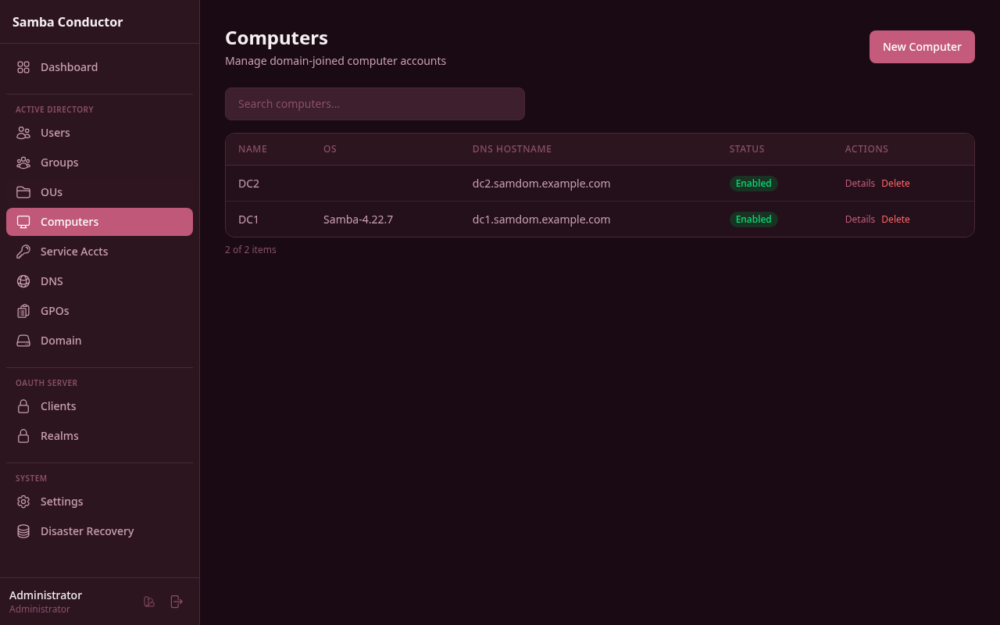
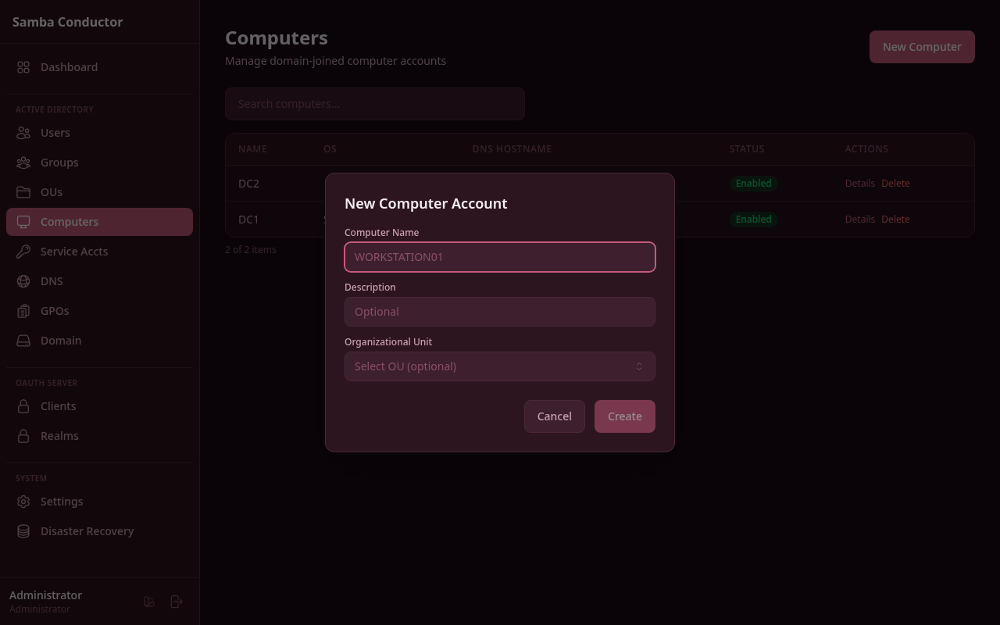

# Computer Management

Manage domain-joined computer accounts -- view the list of computers, pre-create computer accounts, inspect detailed properties, and delete computer objects.

## Accessing This Page

Navigate to **Admin** > **Computers** or go to `/admin/computers`.

## Features

### Computer List

The computer list displays all domain computer accounts in a searchable table with the following columns:

- **Name** -- the computer's sAMAccountName
- **OS** -- the operating system reported by the computer
- **DNS Hostname** -- the computer's fully qualified DNS name
- **Status** -- shows **Enabled** (green badge) or **Disabled** (red badge)
- **Actions** -- Details and Delete buttons

Use the search bar to filter computers by any visible field.

### Creating a Computer Account

Pre-creating a computer account allows you to configure a machine's domain membership before the computer is joined.

1. Click the **New Computer** button in the top-right corner.
2. In the modal, fill in the fields:

| Field | Required | Description |
|-------|----------|-------------|
| Computer Name | Yes | The sAMAccountName for the computer (e.g., `WORKSTATION01`). |
| Description | No | An optional description. |
| Organizational Unit | No | Select the OU where the computer account will be created. Uses an OU picker to browse the directory tree. |

3. Click **Create**.

### Viewing Computer Details

1. From the computer list, click **Details** in the Actions column.
2. A detail panel opens below the table showing the computer's properties:

| Property | Description |
|----------|-------------|
| sAMAccountName | The computer's account name in AD. |
| DNS Hostname | Fully qualified domain name. |
| Operating System | OS name reported by the machine. |
| OS Version | OS version string. |
| Description | Description attribute. |
| Status | Enabled or Disabled. |
| Created | Timestamp of when the account was created. |
| Managed By | DN of the user or group managing this computer. |
| DN | The computer's full distinguished name. |
| Groups | List of groups the computer is a member of. |

3. Click **Close** to dismiss the detail panel.

### Deleting a Computer

1. From the computer list, click **Delete** in the Actions column.
2. A confirmation dialog appears.
3. Click **Delete** to confirm.

This action permanently removes the computer account from Active Directory.
