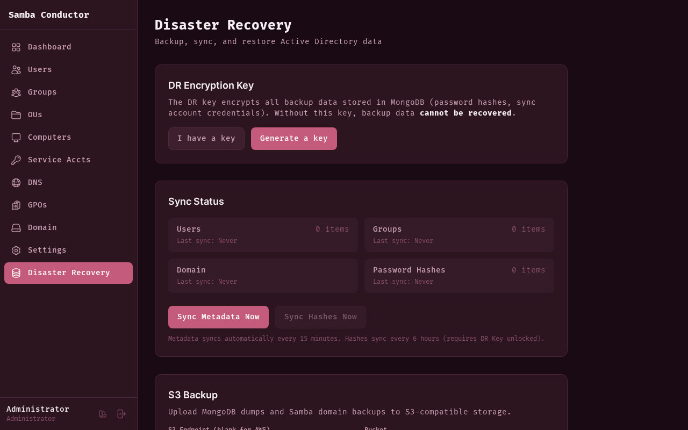

# Disaster Recovery

Back up, synchronize, and restore Active Directory users and groups. This page provides tools for protecting your domain
data and recovering from failures.

## Accessing This Page

Navigate to **Admin** > **Disaster Recovery** or go to `/admin/dr`.

## DR Encryption Key

The DR Key encrypts all backup data stored in MongoDB, including password hashes and sync account credentials. Without
this key, backup data **cannot be recovered**.

### Initial Setup

When no DR Key is configured, you have two options:

- **Generate a key** -- Samba Conductor creates a random 64-character hex key. You must copy and save it immediately.
  The key is shown only once and cannot be recovered.
- **I have a key** -- Enter an existing key (hex string, at least 32 characters) if you are restoring a previous
  installation.

After generating a key, you must check the "I have saved this key in a secure location" checkbox before the **Configure
** button becomes active.

> **Critical:** Store the DR Key in a password manager, a printed copy in a safe, or another secure offline location.
> Losing this key means all encrypted backup data is permanently inaccessible.

### Unlocking After Restart

The DR Key is held in server memory only. After a server restart, the key is locked and must be re-entered.

1. Enter your DR Key in the password field.
2. Click **Unlock**.

**Tip:** Set the `DR_KEY` environment variable to auto-unlock the DR Key on server startup, avoiding manual intervention
after restarts.

### Status Indicators

- **Green badge** -- "DR Key is active. All backup data is encrypted." The key is configured and unlocked.
- **Yellow badge** -- "DR Key is configured but locked." The key exists but needs to be unlocked (typically after a
  restart).

## Sync Status

Samba Conductor maintains a local copy of your AD data in MongoDB for backup and disaster recovery purposes.

### Sync Items

The sync dashboard shows four categories:

| Category            | Description                                                       |
|---------------------|-------------------------------------------------------------------|
| **Users**           | AD user accounts with item count and last sync timestamp          |
| **Groups**          | AD groups with item count and last sync timestamp                 |
| **Domain**          | Domain-level configuration with last sync timestamp               |
| **Password Hashes** | Encrypted password hashes with item count and last sync timestamp |

### Manual Sync

- **Sync Metadata Now** -- Immediately synchronizes users, groups, and domain data. Reports the number of users and
  groups synced.
- **Sync Hashes Now** -- Immediately synchronizes password hashes. Requires the DR Key to be unlocked (button is
  disabled otherwise).

### Automatic Schedule

- Metadata syncs automatically every **15 minutes**.
- Password hashes sync automatically every **6 hours** (only when the DR Key is unlocked).

## S3 Backup

Upload MongoDB dumps and Samba domain backups to any S3-compatible storage (AWS S3, MinIO, Backblaze B2, etc.).

### Configuration Fields

| Field                        | Description                                                                           |
|------------------------------|---------------------------------------------------------------------------------------|
| **S3 Endpoint**              | Custom endpoint URL. Leave blank for AWS S3.                                          |
| **Bucket**                   | The S3 bucket name (required).                                                        |
| **Access Key ID**            | S3 access key (required).                                                             |
| **Secret Access Key**        | S3 secret key (required). Shows "(unchanged)" when editing an existing configuration. |
| **Region**                   | AWS region (default: `us-east-1`).                                                    |
| **Prefix**                   | Object key prefix for backup files (default: `samba-conductor/`).                     |
| **Retention (days)**         | How long to keep backup files before cleanup (default: 30).                           |
| **Schedule (every N hours)** | Interval for automatic backups (default: 6).                                          |

### Backup Options

- **Include MongoDB dump** -- Back up the Samba Conductor MongoDB database.
- **Include Samba domain backup** -- Back up the Samba AD domain data.
- **Enable scheduled backups** -- Turn on automatic backups at the configured interval.

### Actions

- **Test & Save** -- Validates the S3 credentials by testing the connection, then saves the configuration.
- **Backup Now** -- Triggers an immediate backup (only available after configuration is saved and the DR Key is
  unlocked). Reports the number of files uploaded and any errors.

The last backup status is shown at the top of the section with timestamp, file count, and error count (if any).

## Restore from Snapshot

Recreate AD users and groups from the latest MongoDB snapshot. This is intended for use after provisioning a new, empty
domain.

### Preview

1. Click **Load Restore Preview** to see what data is available for restore.
2. The preview shows three cards:
    - **Users** -- Number of user accounts available, with snapshot timestamp.
    - **Groups** -- Number of groups available, with snapshot timestamp.
    - **Password Hashes** -- Number of hashes available, and whether they can be restored (requires DR Key to be
      unlocked).

### Performing a Restore

1. Review the preview data.
2. Click **Start Restore**.
3. Confirm the operation in the dialog. The warning explains that existing accounts with the same name will be skipped.
4. Wait for the restore to complete.

### Restore Results

After completion, a summary shows:

- **Users** -- Created, skipped (already existed), and failed counts.
- **Groups** -- Created, skipped, and memberships restored counts.

> **Warning:** Restore is designed for repopulating an empty domain. Running it against a domain with existing accounts
> will skip duplicates, but you should verify the results carefully.
