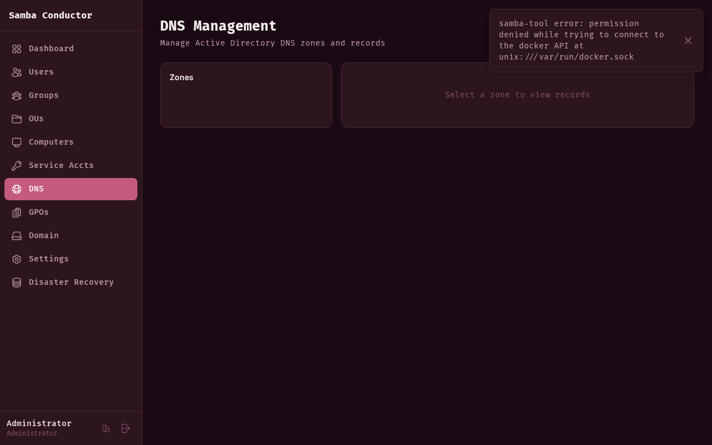

# DNS Management

Manage Active Directory DNS zones and records directly from the web interface.

## Accessing This Page

Navigate to **Admin** > **DNS Management** or go to `/admin/dns`.

## Zone List

The left panel displays all DNS zones registered in your Samba Active Directory domain. Each zone shows its **name** and **type** (e.g., forward lookup, reverse lookup).

Click on a zone to load its records in the right panel.

## Viewing Records

After selecting a zone, the records panel shows a table with the following columns:

| Column | Description |
|--------|-------------|
| **Name** | The record hostname (e.g., `www`, `mail`, `@`) |
| **Type** | The DNS record type (A, AAAA, CNAME, etc.) |
| **Data** | The record value (IP address, hostname, text, etc.) |
| **TTL** | Time to live in seconds |
| **Action** | Delete button for removing the record |

If the zone has no records, a "No records found" message is displayed.

## Adding a Record

1. Select a zone from the zone list.
2. Click the **Add Record** button in the top-right corner of the records panel.
3. Fill in the form fields:
   - **Name** -- The record name (e.g., `www`, `mail`, `_sip._tcp`).
   - **Type** -- Select from the dropdown: A, AAAA, CNAME, MX, TXT, SRV, PTR, NS.
   - **Data** -- The record value. What you enter depends on the type:

| Type | Data format | Example |
|------|-------------|---------|
| **A** | IPv4 address | `192.168.1.10` |
| **AAAA** | IPv6 address | `2001:db8::1` |
| **CNAME** | Target hostname | `web.example.com` |
| **MX** | Priority and mail server | `10 mail.example.com` |
| **TXT** | Arbitrary text | `v=spf1 include:example.com ~all` |
| **SRV** | Priority weight port target | `0 5 5060 sip.example.com` |
| **PTR** | Target hostname | `host.example.com` |
| **NS** | Name server hostname | `ns1.example.com` |

4. Click **Add Record** to save. A confirmation message appears and the records list refreshes automatically.

## Deleting a Record

1. In the records table, click **Delete** on the row you want to remove.
2. A confirmation dialog appears showing the record type, name, and data.
3. Click **Delete** to confirm, or **Cancel** to abort.

The record is removed from the zone immediately and the table refreshes.

> **Warning:** Deleting critical DNS records (such as domain controller SRV records or NS records) can cause service disruptions. Verify the record before deleting.
