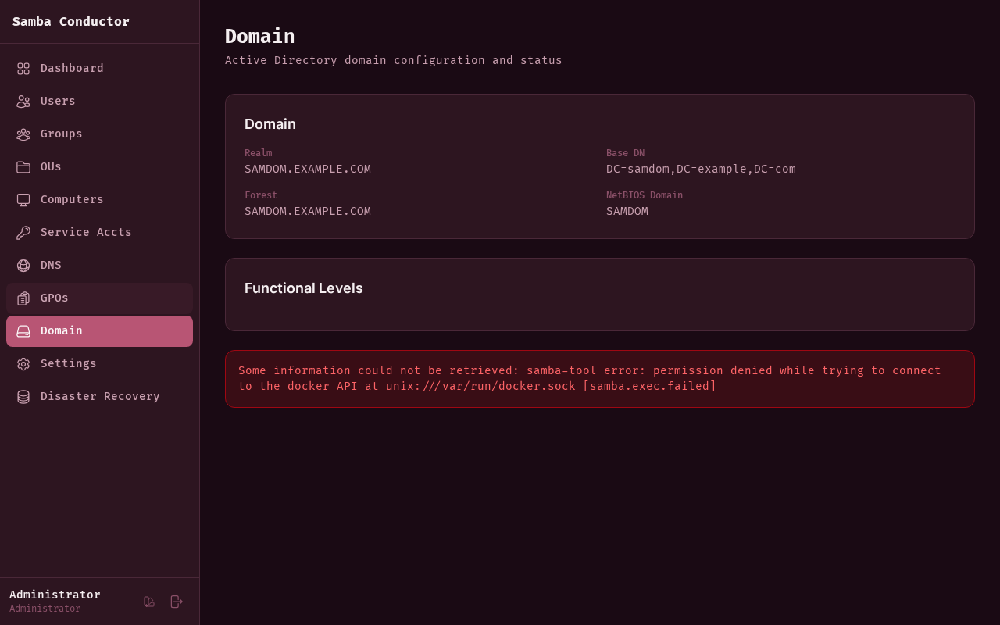

# Domain Information

The Domain page shows the current Active Directory domain configuration and status.

## Information Displayed

### Domain

- **Realm** — The Kerberos realm (e.g., `SAMDOM.EXAMPLE.COM`)
- **Base DN** — The LDAP base distinguished name
- **Forest** — The AD forest name
- **Domain Controller** — The DC hostname
- **Server Site** — The AD site this DC belongs to
- **Client Site** — The site detected for clients

### Functional Levels

- **Domain Level** — The domain functional level (e.g., Windows Server 2016)
- **Forest Level** — The forest functional level

Samba Conductor provisions domains at **Windows Server 2016** functional level by default.

## Accessing

Navigate to **Admin** > **Domain** in the sidebar.
