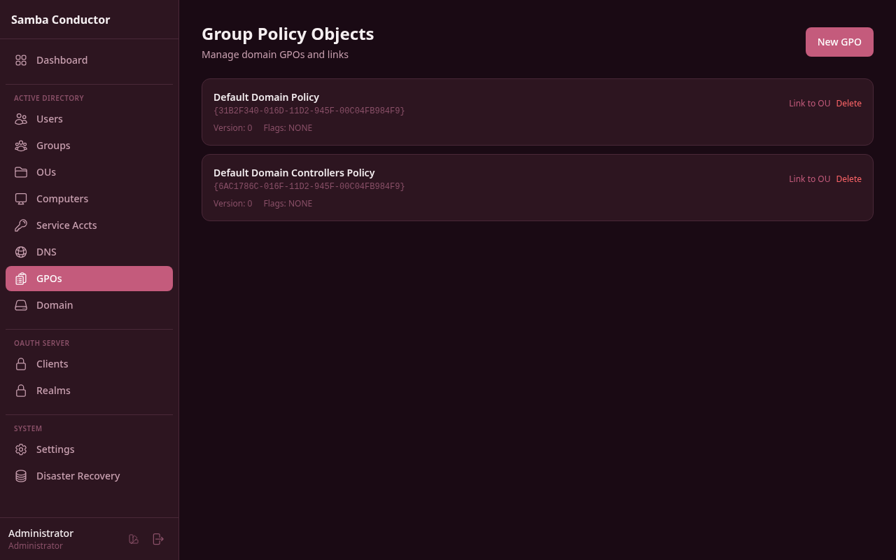
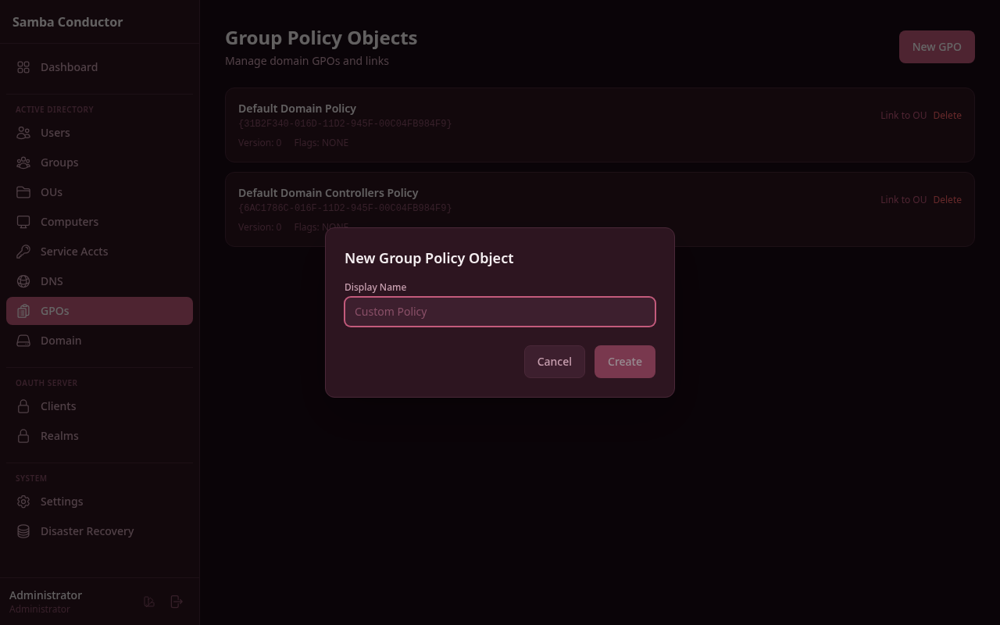

# Group Policy Objects (GPO) Management

Create, link, and delete Group Policy Objects for your Active Directory domain.

## Accessing This Page

Navigate to **Admin** > **Group Policy Objects** or go to `/admin/gpos`.

## GPO List

The page displays all existing GPOs as cards. Each card shows:

- **Display Name** -- The human-readable name of the policy.
- **ID** -- The unique GPO identifier (GUID).
- **Version** -- The current policy version number.
- **Flags** -- GPO status flags.
- **Actions** -- Links to **Link to OU** and **Delete**.

If no GPOs exist, a "No GPOs found" message is shown.

## Creating a GPO

1. Click the **New GPO** button in the top-right corner.
2. In the modal dialog, enter a **Display Name** for the policy (e.g., "Custom Policy", "Password Settings").
3. Click **Create**.

The new GPO appears in the list. You can then link it to an Organizational Unit to apply it.

## Linking a GPO to an OU

1. On the GPO card, click **Link to OU**.
2. In the modal, enter the full **Container DN** (Distinguished Name) of the target OU.
   - Example: `OU=Engineering,DC=samdom,DC=example,DC=com`
3. Click **Link**.

A success message confirms the GPO has been linked. The policy will take effect on the next Group Policy refresh for
objects in that OU.

> **Tip:** You can find OU distinguished names on the Users or Groups pages, or by inspecting the directory tree.

## Deleting a GPO

1. On the GPO card, click **Delete**.
2. A confirmation dialog warns that deleting the GPO will also **remove all its links**.
3. Click **Delete** to confirm, or **Cancel** to abort.

> **Warning:** Deleting a GPO removes the policy and all its links across the domain. This action cannot be undone.
