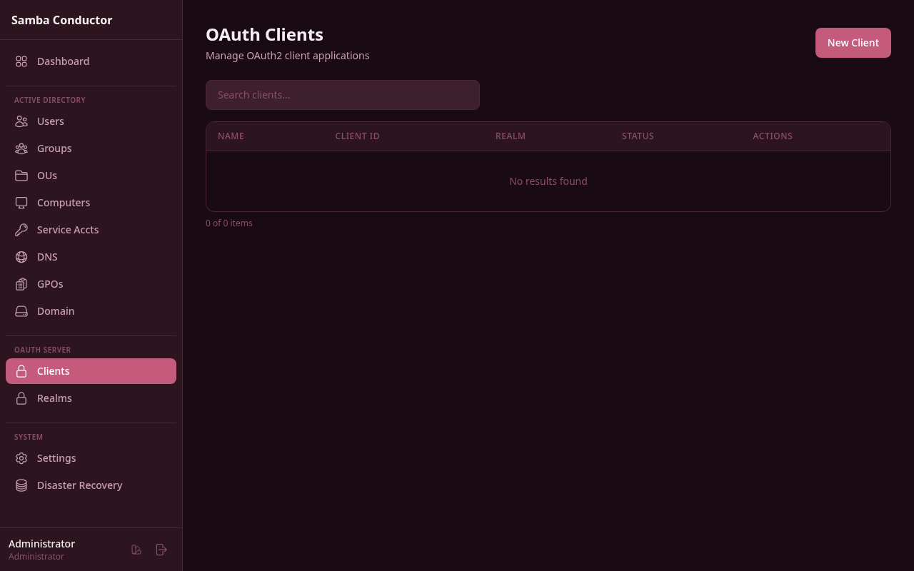

# OAuth Clients



OAuth clients represent third-party applications that can authenticate users via the Samba Conductor OAuth2 server.

## Creating a Client


1. Navigate to **Admin** > **OAuth Clients**
2. Click **New Client**
3. Fill in:
    - **Client Name** — Display name (e.g., "Grafana", "Portainer")
    - **Description** — Optional description
    - **Redirect URIs** — One per line. Must exactly match the callback URL configured in the application
    - **Scopes** — Which user data the client can access (openid, profile, email, groups, phone)
    - **Trusted** — If checked, users won't see a consent screen
4. Click **Create Client**
5. **Save the Client ID and Secret immediately** — the secret is shown only once

## Client Credentials

After creation, you'll see:

- **Client ID** — A UUID used to identify the application
- **Client Secret** — A random 64-character hex string. **Save it now** — it cannot be retrieved later

If you lose the secret, click **Reset Secret** to generate a new one (the old one is immediately invalidated).

## Scopes

| Scope     | Data Returned                                   |
|-----------|-------------------------------------------------|
| `openid`  | User ID (sub)                                   |
| `profile` | Display name, given name, family name, username |
| `email`   | Email address                                   |
| `groups`  | AD group memberships                            |
| `phone`   | Phone number                                    |

## Example: Connecting Grafana

```ini
[auth.generic_oauth]
enabled = true
name = Samba Conductor
client_id = <Client ID from admin panel>
client_secret = <Client Secret shown once>
auth_url = https://conductor.example.com/oauth/authorize
token_url = https://conductor.example.com/oauth/token
api_url = https://conductor.example.com/oauth/userinfo
scopes = openid profile email groups
```

## Example: Connecting Portainer

```
OAuth URL: https://conductor.example.com/oauth/authorize
Token URL: https://conductor.example.com/oauth/token
User Info URL: https://conductor.example.com/oauth/userinfo
Client ID: <from admin panel>
Client Secret: <shown once>
Scopes: openid profile email groups
```

## OAuth2 Endpoints

| Endpoint           | Method | Purpose                              |
|--------------------|--------|--------------------------------------|
| `/oauth/authorize` | GET    | Authorization page (login + consent) |
| `/oauth/token`     | POST   | Exchange code for access token       |
| `/oauth/userinfo`  | GET    | Get user profile (Bearer token)      |
