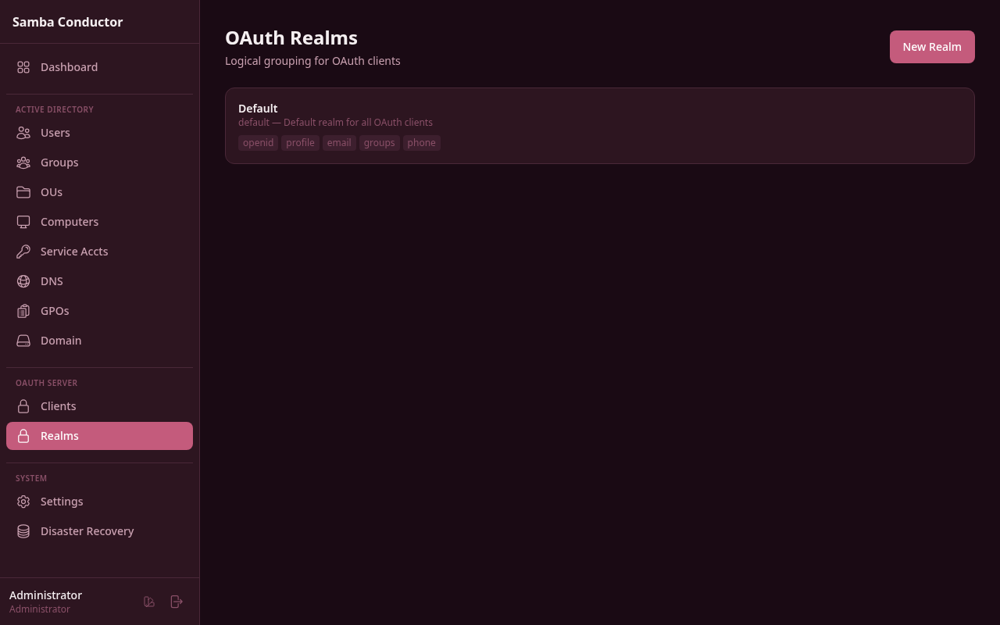

# OAuth Realms



Realms provide logical grouping for OAuth clients, allowing different access policies per group of applications.

## Default Realm

A "Default" realm is created automatically during initial setup. It allows all users and all scopes.

## Creating a Realm

1. Navigate to **Admin** > **OAuth Realms**
2. Click **New Realm**
3. Fill in:
    - **Name** — Unique identifier (e.g., "production", "staging", "partner-apps")
    - **Display Name** — Human-readable name
    - **Allowed Scopes** — Which scopes clients in this realm can request
    - **AD Group Restriction** — Optional: limit access to members of a specific AD group
4. Click **Create**

## AD Group Restriction

When set, only users who are members of the specified AD group can authenticate via clients in this realm. Enter the
full DN:

```
CN=OAuth-Users,CN=Users,DC=samdom,DC=example,DC=com
```

## Assigning Clients to Realms

When creating an OAuth client, select the realm it belongs to. Each client belongs to exactly one realm.

## Use Cases

| Realm        | Purpose                     | AD Group                  |
|--------------|-----------------------------|---------------------------|
| `default`    | All applications, all users | (none)                    |
| `production` | Production apps             | `CN=Production-Users,...` |
| `staging`    | Staging/test apps           | `CN=Developers,...`       |
| `partner`    | External partner apps       | `CN=Partners,...`         |
