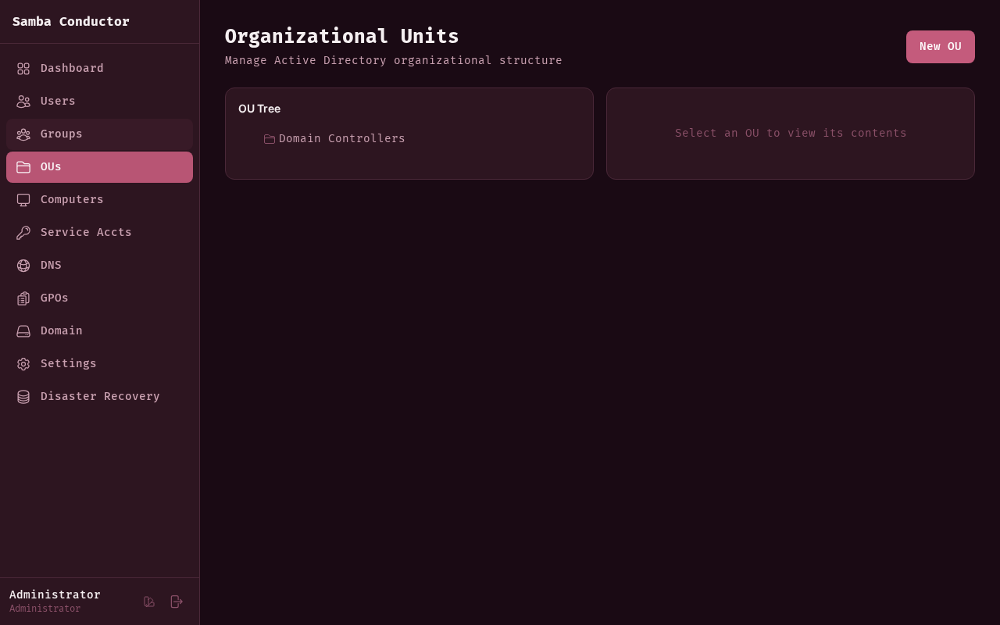

# Organizational Units

Manage the Active Directory organizational structure -- browse the OU hierarchy, view objects within each OU, and create, rename, or delete organizational units.

## Accessing This Page

Navigate to **Admin** > **Organizational Units** or go to `/admin/ous`.

## Features

### Page Layout

The page is split into two panels side by side:

- **Left panel -- OU Tree:** A hierarchical, collapsible tree view of all organizational units.
- **Right panel -- Objects:** Displays the contents of the currently selected OU.

### Browsing the OU Tree

The OU tree shows all organizational units in a nested hierarchy. Each node displays a folder icon and the OU name.

- Click the **arrow** to the left of an OU name to expand or collapse its children.
- Click the **OU name** to select it and load its contents in the right panel.
- The currently selected OU is highlighted.

### Viewing Objects in an OU

When you select an OU from the tree, the right panel lists all objects contained in that OU. Each object shows:

- An icon indicating its type (user, group, computer, or nested OU)
- The object's name
- The object's description (if set)
- A type label (user, group, computer, ou)

If the OU is empty, a "No objects in this OU" message is displayed.

### Creating an OU

1. (Optional) Select a parent OU in the tree. If no OU is selected, the new OU will be created at the domain root.
2. Click the **New OU** button in the top-right corner.
3. In the modal, fill in the fields:

| Field | Required | Description |
|-------|----------|-------------|
| Name | Yes | The name of the new OU (e.g., `Engineering`). |
| Description | No | An optional description. |

4. The modal displays the selected parent OU name (if any).
5. Click **Create**.

### Renaming an OU

1. Hover over an OU in the tree to reveal the action icons.
2. Click the **pencil icon** (Rename).
3. In the modal, enter the new name.
4. Click **Rename**.

### Deleting an OU

1. Hover over an OU in the tree to reveal the action icons.
2. Click the **trash icon** (Delete).
3. A confirmation dialog warns that the OU must be empty before it can be deleted.
4. Click **Delete** to confirm.

If the OU contains any objects (users, groups, computers, or child OUs), the deletion will fail. Move or delete all contained objects first.
