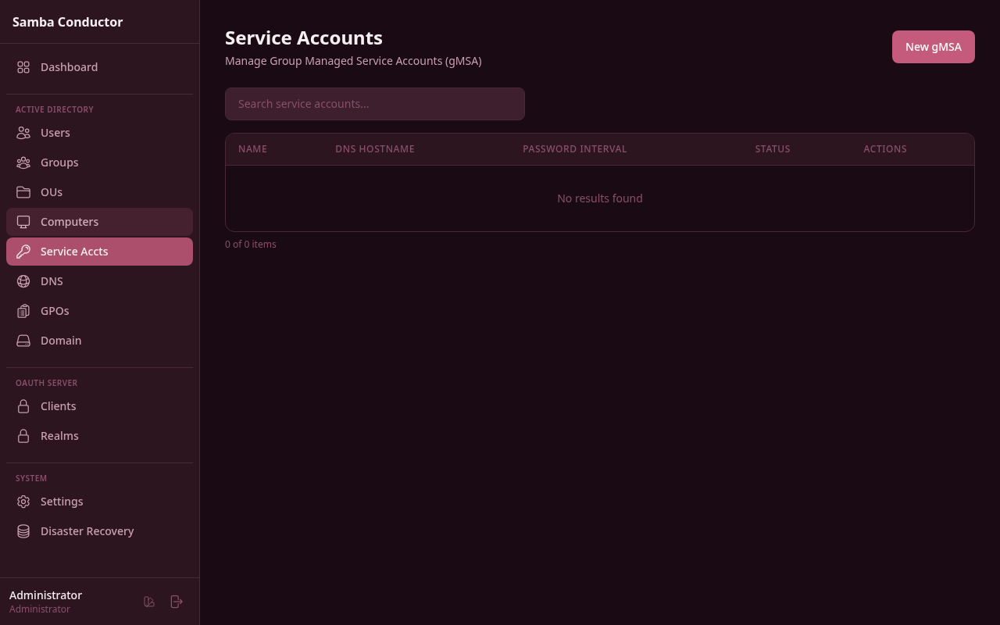
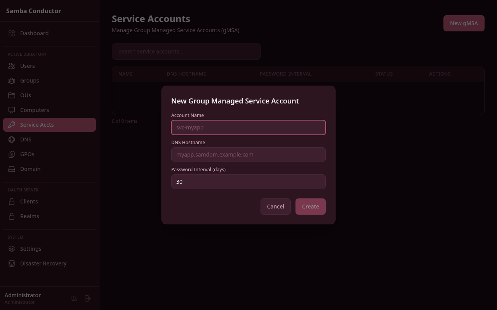

# Service Accounts

Manage Group Managed Service Accounts (gMSA) -- create gMSA entries, view their properties, and delete accounts that are no longer needed.

## Accessing This Page

Navigate to **Admin** > **Service Accounts** or go to `/admin/service-accounts`.

## Features

### Service Account List

The service account list displays all gMSA entries in a searchable table with the following columns:

- **Name** -- the account name
- **DNS Hostname** -- the service principal's DNS hostname
- **Password Interval** -- how often the password is automatically rotated (in days)
- **Status** -- shows **Active** (green badge) or **Disabled** (red badge)
- **Actions** -- Details and Delete buttons

Use the search bar to filter service accounts by any visible field.

### Creating a gMSA

1. Click the **New gMSA** button in the top-right corner.
2. In the modal, fill in the fields:

| Field | Required | Description |
|-------|----------|-------------|
| Account Name | Yes | The name for the service account (e.g., `svc-myapp`). |
| DNS Hostname | Yes | The fully qualified DNS hostname associated with this account (e.g., `myapp.samdom.example.com`). |
| Password Interval (days) | No | Number of days between automatic password rotations. Defaults to `30`. |

3. Click **Create**.

### Viewing Service Account Details

1. From the list, click **Details** in the Actions column.
2. A detail panel opens below the table showing all available properties for the account as key-value pairs.
3. Click **Close** to dismiss the detail panel.

### Deleting a Service Account

1. From the list, click **Delete** in the Actions column.
2. A confirmation dialog appears.
3. Click **Delete** to confirm.

This action permanently removes the gMSA from Active Directory.
