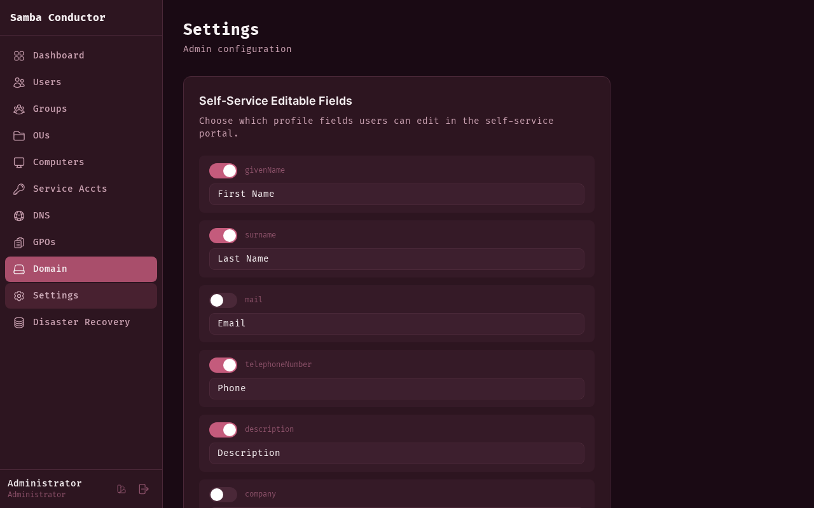

# Settings

Configure self-service portal options and the automated sync account.



## Accessing This Page

Navigate to **Admin** > **Settings** or go to `/admin/settings`.

## Self-Service Editable Fields

This section controls which profile fields are available for users to edit in the self-service portal.

Each field has two controls:

- **Toggle** -- Enable or disable the field. When disabled, users cannot see or edit this field in their profile.
- **Label** -- The display label shown to users (e.g., "Phone Number", "Department"). You can customize labels to match
  your organization's terminology.

The field's internal key (e.g., `telephoneNumber`, `department`) is shown next to the toggle for reference.

### Saving Changes

After toggling fields or editing labels, click **Save Fields** to apply the changes. The self-service portal updates
immediately for all users.

## Sync Account

The sync account is a dedicated Active Directory service account used by Samba Conductor for automated background
operations (e.g., metadata synchronization, read-only queries when a user's session expires).

### Creating the Sync Account

If no sync account is configured:

1. Enter a **Username** for the service account (default: `svc-conductor`).
2. Click **Create & Configure**.

A strong password is generated automatically and stored encrypted on the server. The password is never displayed to
anyone.

### When the Sync Account Is Active

Once configured, the section shows a green status indicator with the active account username.

You can click **Reset Password** to generate a new random password for the sync account. This is useful if you suspect
the account may have been compromised, or as part of routine credential rotation.

> **Note:** The sync account password is stored encrypted and managed entirely by Samba Conductor. You do not need to
> know or enter the password manually.

### Permissions

The sync account needs **write access** to Active Directory for self-service profile editing to work. Add it to
the `Domain Admins` group:

```bash
samba-tool group addmembers "Domain Admins" svc-conductor
```

Or via the Samba Conductor admin panel: **Groups** → edit `Domain Admins` → add `svc-conductor` as member.

> **Production note:** For tighter security, consider creating a delegated OU permission instead of full Domain
> Admin access. The sync account only needs write access to user attributes (mail, telephoneNumber, description,
> etc.) on the OUs where self-service users are located.
