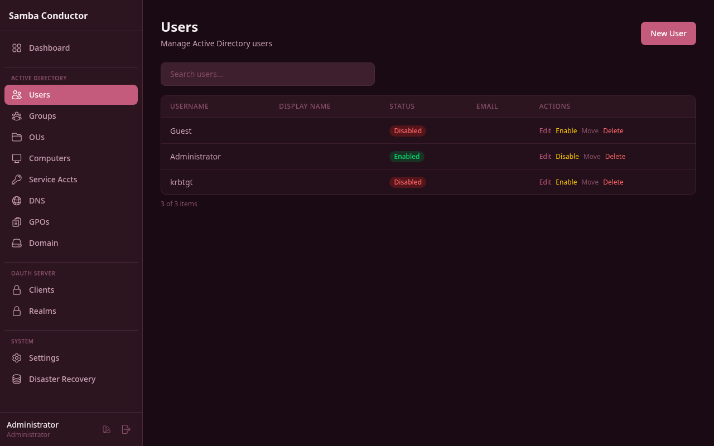
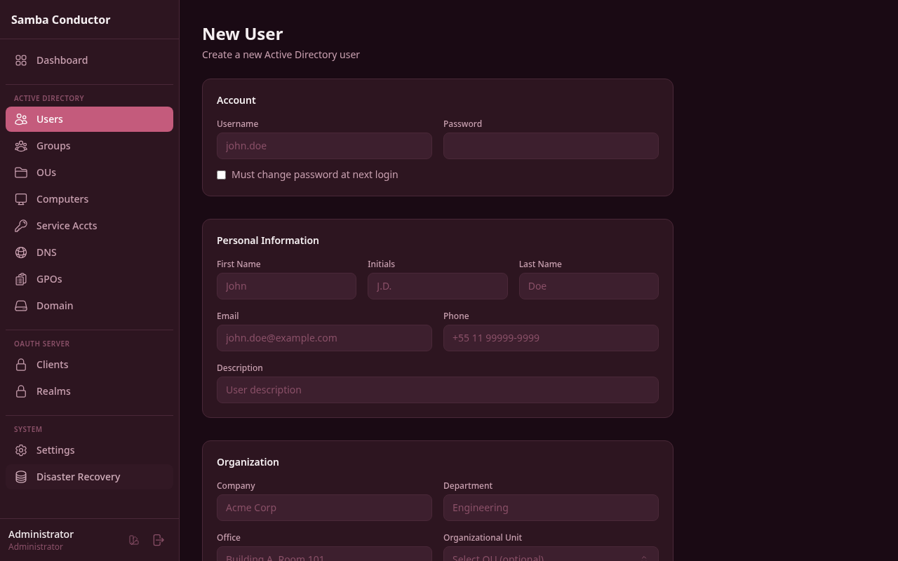
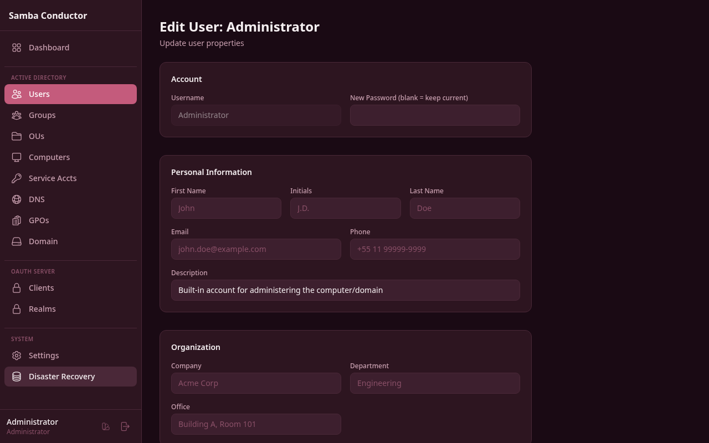

# User Management

Manage Active Directory user accounts -- create, edit, enable/disable, delete, and organize users across organizational units.

## Accessing This Page

Navigate to **Admin** > **Users** or go to `/admin/users`.

## Features

### User List

The user list displays all Active Directory users in a searchable table with the following columns:

- **Username** -- the sAMAccountName
- **Display Name** -- the user's full display name
- **Status** -- shows **Enabled** (green badge) or **Disabled** (red badge)
- **Email** -- the user's mail attribute
- **Actions** -- Edit, Enable/Disable, Move, and Delete buttons

Use the search bar at the top of the table to filter users by any visible field.

### Creating a User

1. Click the **New User** button in the top-right corner.
2. Fill in the form fields described below.
3. Click **Create User**.

**Route:** `/admin/users/new`

#### Account Section

| Field | Required | Description |
|-------|----------|-------------|
| Username | Yes | The sAMAccountName (e.g., `john.doe`). Cannot be changed after creation. |
| Password | Yes | Initial password for the account. |
| Must change password at next login | No | When checked, the user will be forced to set a new password on first login. |

#### Personal Information Section

| Field | Required | Description |
|-------|----------|-------------|
| First Name | No | Given name (e.g., `John`). |
| Initials | No | Middle initials (e.g., `J.D.`). |
| Last Name | No | Surname (e.g., `Doe`). |
| Email | No | Email address. |
| Phone | No | Telephone number. |
| Description | No | Free-text description of the user. |

#### Organization Section

| Field | Required | Description |
|-------|----------|-------------|
| Company | No | Company name. |
| Department | No | Department name. |
| Office | No | Physical office location. |
| Organizational Unit | No | Select the OU where the user will be created. Uses an OU picker to browse the directory tree. |

#### Unix Attributes (RFC2307) Section

This section is collapsible and only available during user creation. Expand it by clicking **Show**.

| Field | Required | Description |
|-------|----------|-------------|
| Home Directory | No | Unix home directory path (e.g., `/home/john.doe`). |
| Login Shell | No | Default shell (e.g., `/bin/bash`). |
| UID Number | No | Numeric Unix user ID. |
| GID Number | No | Numeric Unix primary group ID. |

### Editing a User

1. From the user list, click **Edit** on the desired user row.
2. Modify the available fields.
3. Click **Save Changes**.

**Route:** `/admin/users/:username/edit`

When editing, the **Username** field is read-only. The Unix Attributes section and the "Must change password at next login" checkbox are not available during editing.

### Resetting a Password

On the edit form, enter a new value in the **New Password** field. Leave it blank to keep the current password. The password is updated when you click **Save Changes**.

### Enabling or Disabling a User

You can toggle a user's account status from two places:

**From the user list:**
1. Click the **Disable** (or **Enable**) button in the Actions column.
2. A confirmation dialog appears explaining the effect.
3. Click **Disable** or **Enable** to confirm.

**From the edit form:**
1. In the **Location & Status** section, click the **Disable** (or **Enable**) button.
2. Confirm the action in the dialog.

Disabled users cannot log in to the domain.

### Moving a User to a Different OU

You can move a user from two places:

**From the user list:**
1. Click **Move** in the Actions column.
2. A modal appears with an OU picker.
3. Select the destination OU.
4. Click **Move**.

**From the edit form:**
1. In the **Location & Status** section, the current OU is displayed.
2. Use the OU picker to select a new location. The move happens immediately upon selection.

### Managing Group Membership

Group membership management is available only on the edit form, below the main form.

**Adding a user to a group:**
1. Open the user's edit form.
2. Scroll to the **Group Membership** section.
3. Select a group from the dropdown (only groups the user is not already a member of are shown).
4. Click **Add**.

**Removing a user from a group:**
1. In the Group Membership section, find the group in the list.
2. Click **Remove** next to the group name.

The member count is displayed in the section header.

### Deleting a User

1. From the user list, click **Delete** in the Actions column.
2. A confirmation dialog warns that deletion cannot be undone.
3. Click **Delete** to confirm.

This action permanently removes the user account from Active Directory.
