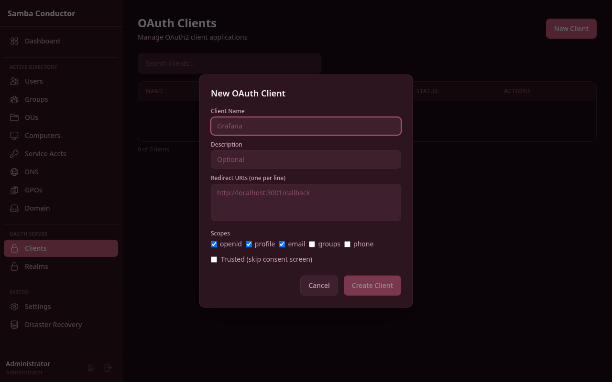

# OAuth2 Integration Guide

This guide shows how to connect third-party applications to Samba Conductor via OAuth2, using Grafana as a complete
working example.

## How It Works

```
┌──────────┐     ┌───────────────────┐     ┌──────────┐
│  Grafana  │────►│  Samba Conductor  │────►│ Samba AD │
│  (Client) │◄────│  (OAuth2 Server)  │◄────│  (LDAP)  │
└──────────┘     └───────────────────┘     └──────────┘

1. User clicks "Sign in with Samba Conductor" in Grafana
2. Browser redirects to Samba Conductor /oauth/authorize
3. User enters AD credentials (LDAP bind)
4. Authorization code returned to Grafana
5. Grafana exchanges code for access token
6. Grafana calls /oauth/userinfo to get user profile
7. User is logged into Grafana with AD identity
```

## Step 1: Create an OAuth Client in Samba Conductor

1. Login to the admin panel (`/admin`)
2. Go to **OAuth Clients** in the sidebar
3. Click **New Client**
4. Fill in:
    - **Client Name:** `Grafana`
    - **Redirect URIs:** `http://localhost:3001/login/generic_oauth`
    - **Scopes:** openid, profile, email, groups (all checked)
    - **Trusted:** checked (skip consent screen for internal apps)
5. Click **Create Client**
6. **Copy the Client ID and Secret** — you'll need them in the next step



> The secret is shown only once. If you lose it, click "Reset Secret" on the client list.

## Step 2: Configure Grafana

### Option A: Docker Compose (recommended for testing)

Create a `docker-compose.grafana.yml`:

```yaml
services:
  grafana:
    image: grafana/grafana:latest
    container_name: grafana
    ports:
      - "3001:3000"
    environment:
      # Admin
      - GF_SECURITY_ADMIN_USER=admin
      - GF_SECURITY_ADMIN_PASSWORD=admin

      # OAuth2 — Samba Conductor
      - GF_AUTH_GENERIC_OAUTH_ENABLED=true
      - GF_AUTH_GENERIC_OAUTH_NAME=Samba Conductor
      - GF_AUTH_GENERIC_OAUTH_CLIENT_ID=<YOUR_CLIENT_ID>
      - GF_AUTH_GENERIC_OAUTH_CLIENT_SECRET=<YOUR_CLIENT_SECRET>
      - GF_AUTH_GENERIC_OAUTH_AUTH_URL=http://localhost:4080/oauth/authorize
      - GF_AUTH_GENERIC_OAUTH_TOKEN_URL=http://host.docker.internal:4080/oauth/token
      - GF_AUTH_GENERIC_OAUTH_API_URL=http://host.docker.internal:4080/oauth/userinfo
      - GF_AUTH_GENERIC_OAUTH_SCOPES=openid profile email groups
      - GF_AUTH_GENERIC_OAUTH_EMAIL_ATTRIBUTE_PATH=email
      - GF_AUTH_GENERIC_OAUTH_LOGIN_ATTRIBUTE_PATH=login
      - GF_AUTH_GENERIC_OAUTH_NAME_ATTRIBUTE_PATH=name
      - GF_AUTH_GENERIC_OAUTH_ALLOW_SIGN_UP=true

      # Map AD groups to Grafana roles
      - GF_AUTH_GENERIC_OAUTH_ROLE_ATTRIBUTE_PATH=contains(groups[*], 'Domain Admins') && 'GrafanaAdmin' || 'Viewer'
      - GF_AUTH_GENERIC_OAUTH_ALLOW_ASSIGN_GRAFANA_ADMIN=true

      # Server URL (important for redirects)
      - GF_SERVER_ROOT_URL=http://localhost:3001

    extra_hosts:
      - "host.docker.internal:host-gateway"
```

> **Important URLs:**
> - `auth_url` uses `localhost:4080` — this is what the **browser** sees
> - `token_url` and `api_url` use `host.docker.internal:4080` — this is what the **Grafana container** uses to
    > reach Meteor on the host

Start Grafana:

```bash
docker compose -f docker-compose.grafana.yml up -d
```

### Option B: grafana.ini

If you prefer configuring via file:

```ini
[server]
root_url = http://localhost:3001

[auth.generic_oauth]
enabled = true
name = Samba Conductor
client_id = <YOUR_CLIENT_ID>
client_secret = <YOUR_CLIENT_SECRET>
auth_url = http://localhost:4080/oauth/authorize
token_url = http://localhost:4080/oauth/token
api_url = http://localhost:4080/oauth/userinfo
scopes = openid profile email groups
email_attribute_path = email
login_attribute_path = login
name_attribute_path = name
allow_sign_up = true
role_attribute_path = contains(groups[*], 'Domain Admins') && 'GrafanaAdmin' || 'Viewer'
allow_assign_grafana_admin = true
```

## Step 3: Test the Login

1. Open Grafana at `http://localhost:3001`
2. Click **"Sign in with Samba Conductor"**
3. You'll be redirected to the Samba Conductor login page
4. Enter your AD credentials (e.g., `Administrator` / `P@ssw0rd123!`)
5. After authentication, you'll be redirected back to Grafana, logged in

### What Happens Behind the Scenes

1. Grafana redirects to:
   ```
   http://localhost:4080/oauth/authorize?
     client_id=<id>&
     redirect_uri=http://localhost:3001/login/generic_oauth&
     response_type=code&
     scope=openid+profile+email+groups&
     state=<random>
   ```

2. Samba Conductor shows the login form

3. User authenticates → LDAP bind against Samba AD

4. Samba Conductor redirects back:
   ```
   http://localhost:3001/login/generic_oauth?code=<auth_code>&state=<random>
   ```

5. Grafana server calls (server-to-server):
   ```
   POST http://host.docker.internal:4080/oauth/token
   Content-Type: application/x-www-form-urlencoded

   grant_type=authorization_code&
   code=<auth_code>&
   redirect_uri=http://localhost:3001/login/generic_oauth&
   client_id=<id>&
   client_secret=<secret>
   ```

6. Grafana receives access token and calls:
   ```
   GET http://host.docker.internal:4080/oauth/userinfo
   Authorization: Bearer <access_token>
   ```

7. Samba Conductor returns:
   ```json
   {
     "sub": "meteor_user_id",
     "login": "Administrator",
     "email": "admin@samdom.example.com",
     "name": "Administrator",
     "groups": ["Domain Admins", "Schema Admins", "Enterprise Admins"]
   }
   ```

8. Grafana maps `groups` to roles via `role_attribute_path`

## Role Mapping

The `role_attribute_path` uses [JMESPath](https://jmespath.org/) expressions:

| Expression                                                             | Result                                        |
|------------------------------------------------------------------------|-----------------------------------------------|
| `contains(groups[*], 'Domain Admins') && 'GrafanaAdmin' \|\| 'Viewer'` | Domain Admins → GrafanaAdmin, others → Viewer |
| `contains(groups[*], 'Developers') && 'Editor' \|\| 'Viewer'`          | Developers → Editor, others → Viewer          |
| `'Editor'`                                                             | Everyone gets Editor role                     |

## Connecting Other Applications

### Portainer

```
Authentication Method: OAuth
Client ID: <from Samba Conductor>
Client Secret: <from Samba Conductor>
Authorization URL: https://conductor.example.com/oauth/authorize
Access Token URL: https://conductor.example.com/oauth/token
Resource URL: https://conductor.example.com/oauth/userinfo
Redirect URL: https://portainer.example.com
Scopes: openid profile email groups
User Identifier: login
```

### GitLab

```ruby
# gitlab.rb
gitlab_rails['omniauth_providers'] = [
  {
    name: "oauth2_generic",
    label: "Samba Conductor",
    app_id: "<CLIENT_ID>",
    app_secret: "<CLIENT_SECRET>",
    args: {
      client_options: {
        site: "https://conductor.example.com",
        authorize_url: "/oauth/authorize",
        token_url: "/oauth/token",
        user_info_url: "/oauth/userinfo"
      },
      user_response_structure: {
        id_path: ["sub"],
        attributes: {
          email: "email",
          name: "name",
          nickname: "login"
        }
      }
    }
  }
]
```

### Generic (any OAuth2 client library)

| Parameter         | Value                                           |
|-------------------|-------------------------------------------------|
| Authorization URL | `https://conductor.example.com/oauth/authorize` |
| Token URL         | `https://conductor.example.com/oauth/token`     |
| User Info URL     | `https://conductor.example.com/oauth/userinfo`  |
| Scopes            | `openid profile email groups`                   |
| Grant Type        | `authorization_code`                            |

### UserInfo Response Format

```json
{
  "sub": "unique_user_id",
  "id": "unique_user_id",
  "login": "john.doe",
  "email": "john.doe@example.com",
  "email_verified": true,
  "name": "John Doe",
  "given_name": "John",
  "family_name": "Doe",
  "groups": [
    "Domain Users",
    "Developers",
    "VPN-Users"
  ]
}
```

## Requirements

### Email is required

Most OAuth2 clients (Grafana, Portainer, GitLab) require the `email` field in the userinfo response. Users
authenticating via OAuth **must have the `mail` attribute set in Active Directory**.

To set a user's email:

1. Go to **Admin** > **Users** > edit the user
2. Fill in the **Email** field
3. Save

Users without email will get an error like `required attribute email was not provided` when trying to log in via
OAuth.

## Troubleshooting

### "required attribute email was not provided"

The AD user does not have the `mail` attribute set. Edit the user in Samba Conductor and add an email address.

### "Invalid redirect URI"

The redirect URI in the application must **exactly match** what's registered in Samba Conductor. Check:

- Protocol (`http` vs `https`)
- Port number
- Path (e.g., `/login/generic_oauth`)
- No trailing slash

### "Invalid client credentials"

- Verify client_id and client_secret
- If you reset the secret, update it in the application

### Token exchange fails (Grafana in Docker)

The Grafana container can't reach `localhost:4080` — use `host.docker.internal:4080` for `token_url` and `api_url`.
Keep `auth_url` as `localhost:4080` since that's accessed by the browser.

### User not found after login

Ensure the Samba DC is running and the user exists in AD. Check Meteor logs for LDAP bind errors.

### Groups not appearing

Verify the `groups` scope is included in both the client configuration and the application's scope request.
