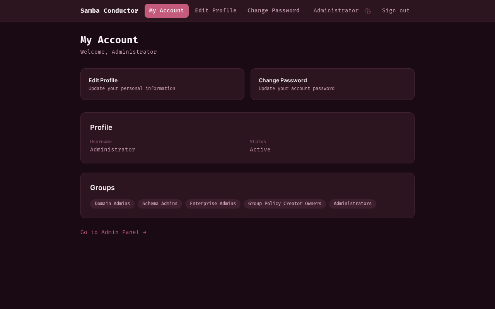
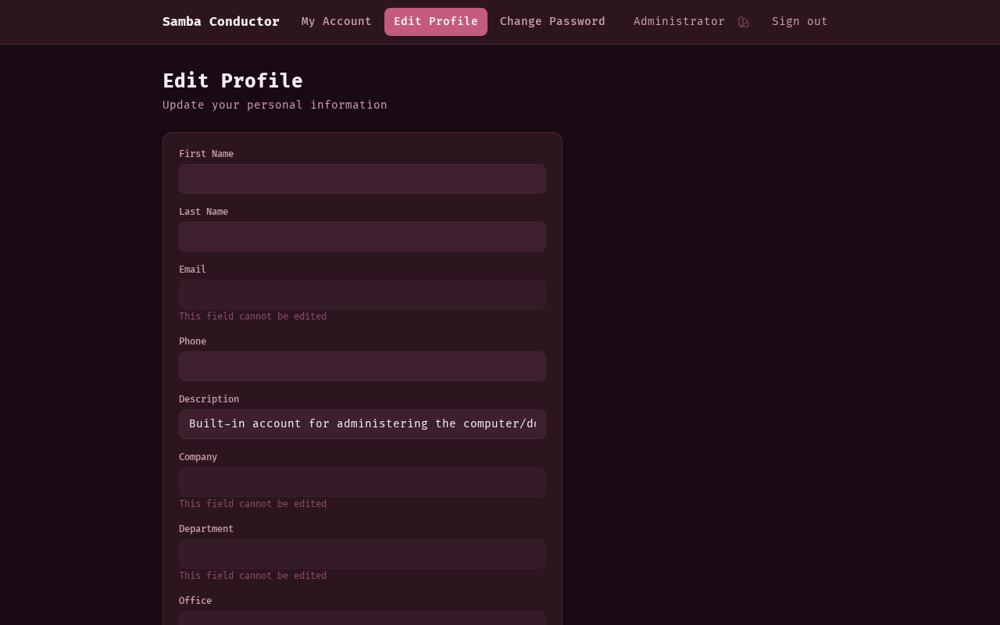
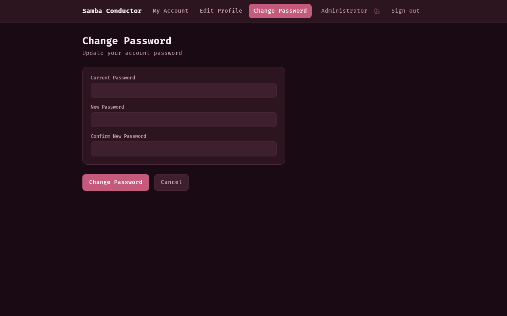

# Self-Service Portal

The self-service portal allows you to manage your own account without contacting an administrator.

## Accessing the Portal

Open your browser and go to the Samba Conductor URL provided by your administrator (e.g.,
`https://conductor.yourcompany.com`).

Log in with your Active Directory credentials:

- **Username:** Your AD username (e.g., `john.doe`)
- **Password:** Your AD password

## My Account

After login, you'll see your account overview:

- **Profile information** — Your name, email, department, etc.
- **Group memberships** — Groups you belong to
- **Quick actions** — Links to edit profile and change password

## Edit Profile

1. Click **Edit Profile** on the home page, or navigate to it from the menu
2. Fields you can edit are determined by your administrator
3. Fields shown as grayed out are read-only
4. Make your changes and click **Save Changes**

> Not all fields may be editable. Contact your administrator if you need to change a read-only field.

## Change Password

1. Click **Change Password** from the menu
2. Enter your **current password**
3. Enter your **new password** (must meet the domain password policy)
4. Confirm the new password
5. Click **Change Password**

### Password Expired

If your password has expired, you'll be automatically redirected to the password change page after login. You must set
a new password before accessing any other features.

When changing an expired password:

- You do **not** need to enter your current password
- Enter and confirm your new password
- After changing, you'll be redirected to the portal

## Signing Out

Click **Sign out** in the top-right corner of the page.

## Admin Access

If you are a member of the **Domain Admins** group, you'll see a link to the Admin Panel at the bottom of your
account page. Click **Go to Admin Panel** to access the full management interface.
